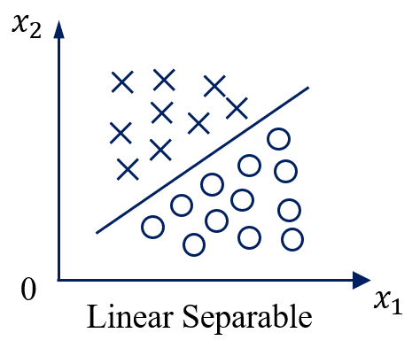
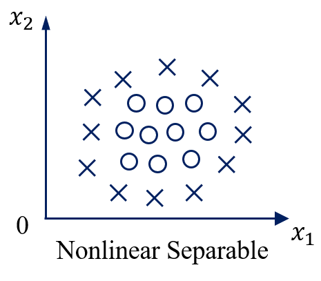
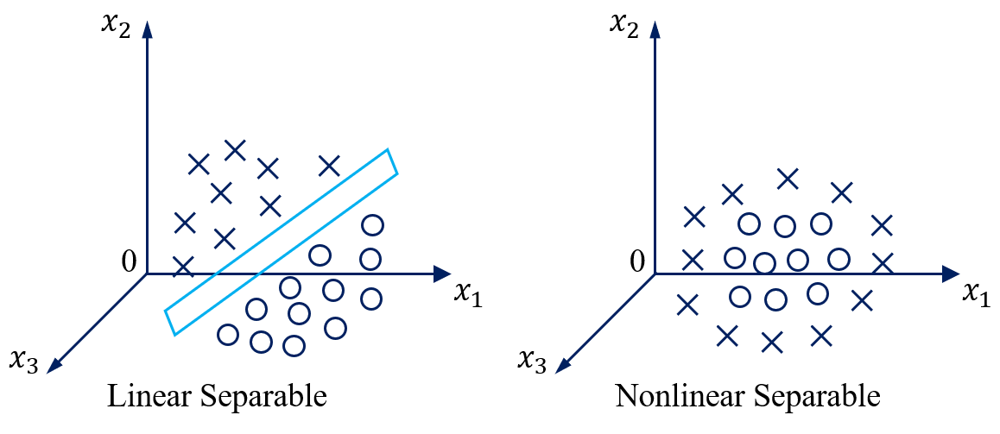

# 支持向量机

- [2.1 线性可分定义](#2.1)
- [2.2 问题描述](#2.2)
- [2.3 优化问题](#2.3)
- [2.4 线性不可分情况](#2.4)
- [2.5 低维到高维的映射](#2.5)
- [2.6 核函数的定义](#2.6)
- [2.7 原问题和对偶问题](#2.7)
- [2.8 转化为对偶问题](#2.8)
- [2.9 算法流程](#2.9)
- [2.10 兵王问题描述](#2.10)
- [2.11 兵王问题程序设计](#2.11)
- [2.12 兵王问题MATLAB程序](#2.12)
- [2.13 识别系统的性能度量](#2.13)
- [2.14 多类情况](#2.14)

## 2.1 线性可分定义

线性可分（Linear Separable）

线性不可分（Nonlinear Separable）

3维线性可分与线性不可分：

特征空间维度 ≥ 四维时 => 超平面（Hyperplane）

特征空间是2维时：

用数学严格定义训练样本以及它们的标签：

假设我们有N个训练样本和它们的标签
$$
{(X_1, y_1),(X_2, y_2), ..., (X_N, y_N)}
$$
其中
$$
X_i = [x_{i1},x_{i2}]^T \\
y_i = {+1, -1}
$$

**用数学严格的定义线性可分**

线性可分的严格定义：一个训练样本集{(Xi, yi), ..., (XN, yN)}，在i=1-N线性可分，是指存在(w1, w2, b)，使得对i=1-N，有：
$$
(1)若 \ y_i = +1, \ 则 \ w_{1}x_{i1}+w_{2}x_{i2}+b > 0 \\
(2)若 \ y_i = -1, \ 则 \ w_{1}x_{i1}+w_{2}x_{i2}+b < 0
$$

**用向量的形式来定义线性可分**

假设：

如果：

$$
Y_i=+1 \ 或 \ -1
$$
一个训练样本集{(Xi, yi)}，在i=1-N线性可分，是指存在(w, b)，使得对i=1-N，有：

总结：

请通过数学定义严格证明，在二分类情况下，如果一个数据集是线性可分的，即存在一个超平面将两个类别完全分开那么一定存在无数多个超平面将这两个类别完全分开。

## 2.2 问题描述
