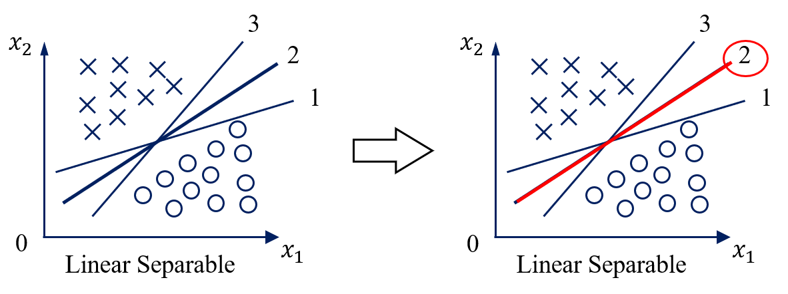
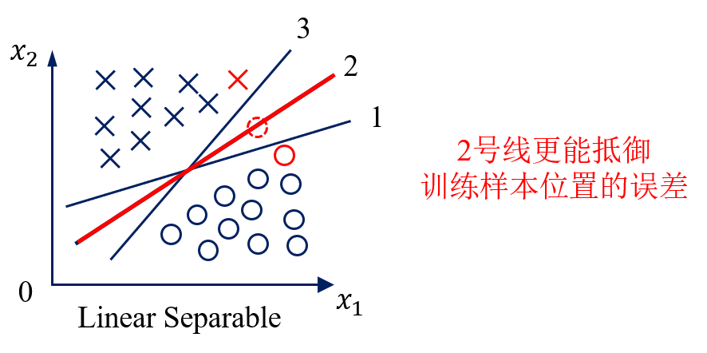
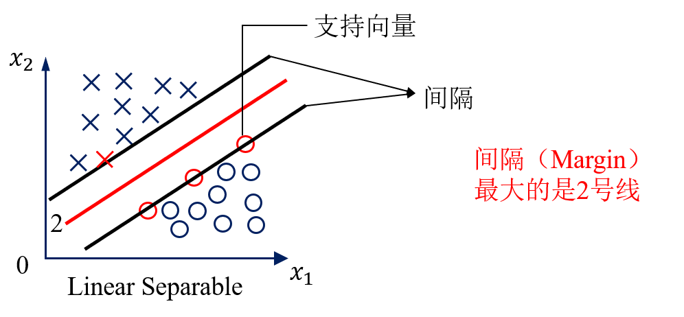
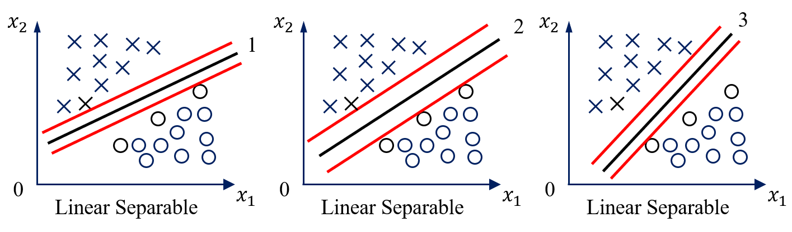
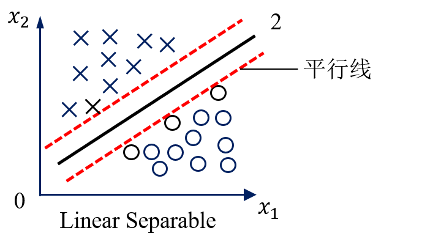

# 支持向量机

- [2.1 线性可分定义](#2.1)
- [2.2 问题描述](#2.2)
- [2.3 优化问题](#2.3)
- [2.4 线性不可分情况](#2.4)
- [2.5 低维到高维的映射](#2.5)
- [2.6 核函数的定义](#2.6)
- [2.7 原问题和对偶问题](#2.7)
- [2.8 转化为对偶问题](#2.8)
- [2.9 算法流程](#2.9)
- [2.10 兵王问题描述](#2.10)
- [2.11 兵王问题程序设计](#2.11)
- [2.12 兵王问题MATLAB程序](#2.12)
- [2.13 识别系统的性能度量](#2.13)
- [2.14 多类情况](#2.14)

## 2.1 线性可分定义

线性可分（Linear Separable）

线性不可分（Nonlinear Separable）

3维线性可分与线性不可分：

特征空间维度 ≥ 四维时 => 超平面（Hyperplane）

特征空间是2维时：

用数学严格定义训练样本以及它们的标签：

假设我们有N个训练样本和它们的标签

**用数学严格的定义线性可分**

线性可分的严格定义：一个训练样本集{(Xi, yi), ..., (XN, yN)}，在i=1-N线性可分，是指存在(w1, w2, b)，使得对i=1-N，有：

**用向量的形式来定义线性可分**

假设：

如果：

一个训练样本集{(Xi, yi)}，在i=1-N线性可分，是指存在(w, b)，使得对i=1-N，有：

#### 总结

请通过数学定义严格证明，在二分类情况下，如果一个数据集是线性可分的，即存在一个超平面将两个类别完全分开那么一定存在无数多个超平面将这两个类别完全分开。

## 2.2 问题描述

支持向量机算法

一、解决线性可分问题；

二、再将线性可分问题中获得的结论推广到线性不可分情况。

#### 如何解决线性可分问题

Vladimir Vapnik：在这无数多个分开各个类别的超平面中，到底哪一个最好呢？

二维特征空间中的二分类问题

认为2号线比较好，实际上是对训练样本的分布有一定的假设。

假设训练样本的位置在特征空间上有测量误差（认为2号线比较好的假设有很多种，这里只取其中的一种）

#### 基于最优化理论

VAPNIK给出的回答

使用MARGIN最大条件 => 不能唯一确定一条直线

这条线在上下两个平行线的中间

**支持向量机寻找的最优分类直线应满足：**

（1）该直线分开了两类；

（2）该直线最大化了间隔（margin）；

（3）该直线处于间隔的中间，到所有支持向量距离相等。

上述讨论时是基于二维特征空间的结果，在高维的特征空间中，直线将变成超平面，但以上的结论仍然是一致的。

#### 思考题

证明：在线性可分条件下，有且只有唯一一条直线，满足上面三个条件。

