# 支持向量机

- [2.1 线性可分定义](#2.1)
- [2.2 问题描述](#2.2)
- [2.3 优化问题](#2.3)
- [2.4 线性不可分情况](#2.4)
- [2.5 低维到高维的映射](#2.5)
- [2.6 核函数的定义](#2.6)
- [2.7 原问题和对偶问题](#2.7)
- [2.8 转化为对偶问题](#2.8)
- [2.9 算法流程](#2.9)
- [2.10 兵王问题描述](#2.10)
- [2.11 兵王问题程序设计](#2.11)
- [2.12 兵王问题MATLAB程序](#2.12)
- [2.13 识别系统的性能度量](#2.13)
- [2.14 多类情况](#2.14)

## 2.1 线性可分定义

线性可分（Linear Separable）

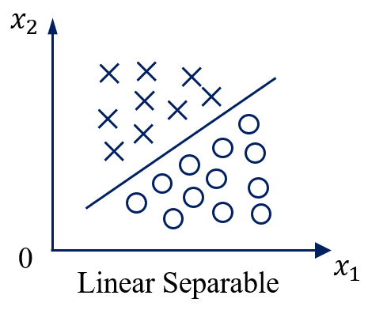

线性不可分（Nonlinear Separable）

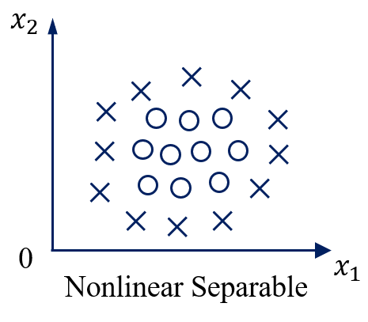

3维线性可分与线性不可分：

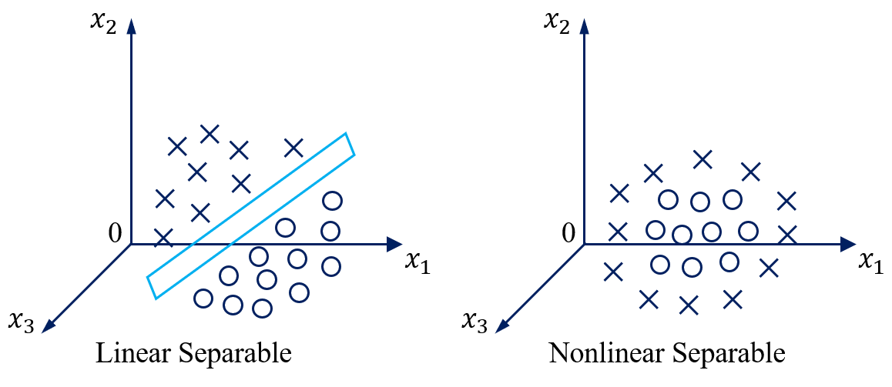

特征空间维度 ≥ 四维时 => 超平面（Hyperplane）

特征空间是2维时：

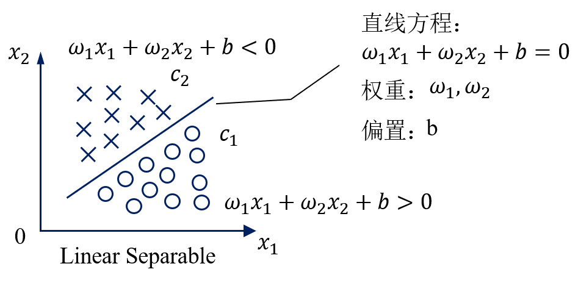

用数学严格定义训练样本以及它们的标签：

假设我们有N个训练样本和它们的标签

**用数学严格的定义线性可分**

线性可分的严格定义：一个训练样本集{(Xi, yi), ..., (XN, yN)}，在i=1-N线性可分，是指存在(w1, w2, b)，使得对i=1-N，有：

**用向量的形式来定义线性可分**

假设：

如果：

一个训练样本集{(Xi, yi)}，在i=1-N线性可分，是指存在(w, b)，使得对i=1-N，有：

#### 总结

请通过数学定义严格证明，在二分类情况下，如果一个数据集是线性可分的，即存在一个超平面将两个类别完全分开那么一定存在无数多个超平面将这两个类别完全分开。

## 2.2 问题描述

支持向量机算法

一、解决线性可分问题；

二、再将线性可分问题中获得的结论推广到线性不可分情况。

#### 如何解决线性可分问题

Vladimir Vapnik：在这无数多个分开各个类别的超平面中，到底哪一个最好呢？

二维特征空间中的二分类问题

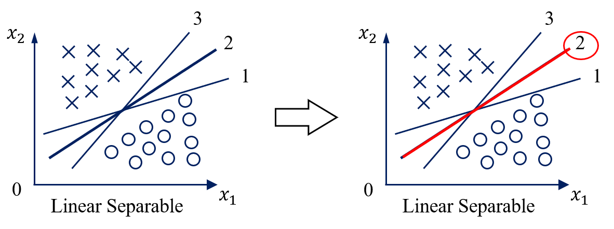

认为2号线比较好，实际上是对训练样本的分布有一定的假设。

假设训练样本的位置在特征空间上有测量误差（认为2号线比较好的假设有很多种，这里只取其中的一种）

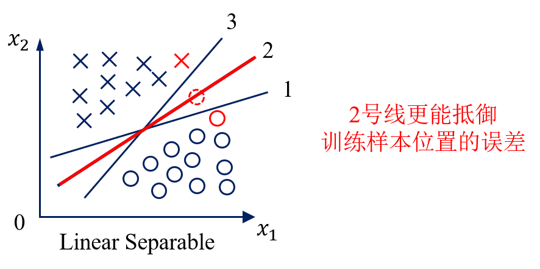

#### 基于最优化理论

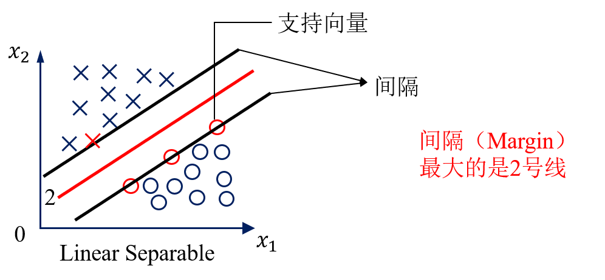

VAPNIK给出的回答

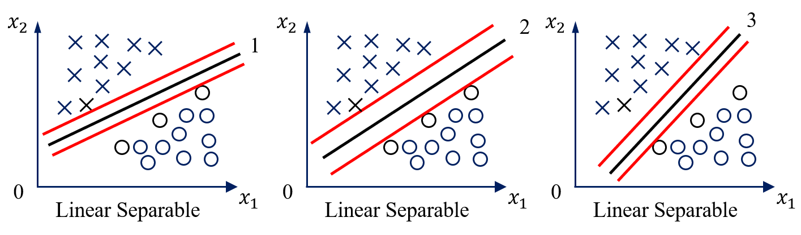

使用MARGIN最大条件 => 不能唯一确定一条直线

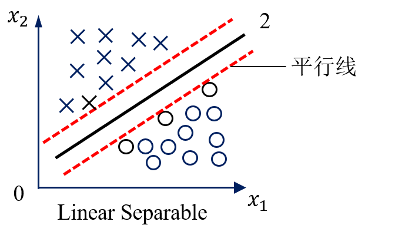

这条线在上下两个平行线的中间

**支持向量机寻找的最优分类直线应满足：**

（1）该直线分开了两类；

（2）该直线最大化间隔（margin）；

（3）该直线处于间隔的中间，到所有支持向量距离相等。

上述讨论时是基于二维特征空间的结果，在高维的特征空间中，直线将变成超平面，但以上的结论仍然是一致的。

#### 思考题

证明：在线性可分条件下，有且只有唯一一条直线，满足上面三个条件。

## 2.3 优化问题

最优分类超平面应该满足：

1. 该超平面分开了两个类；

2. 该超平面有最大化间隔；

3. 该超平面处于间隔的中间，到所有支持向量距离相等。

如何用严格的数学 => 寻找最优分类超平面的过程 => 写成一个最优化问题

**假定训练样本集是线性可分的**

支持向量机需要寻找的是最大化间隔（MARGIN）的超平面

#### 最小化（Minimize）

因此，支持向量机的问题是最小化w模的平方。

#### 限制条件

已知：训练样本集{(Xi, yi)}，i=1-N；

待求：(w, b)

支持向量机要找一个超平面，使它的间隔最大；离两边所有支持向量的距离相等（恰好在间隔的中间）。

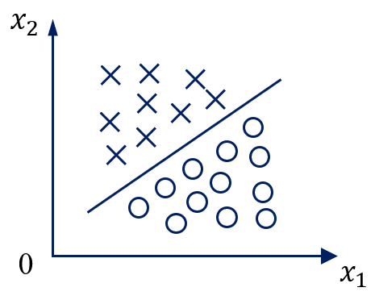

事实1：

事实2：

点到超平面的距离公式

**支持向量机优化问题推导中最难理解的部分**

用 a 去缩放 wb

(w, b)表示的超平面和(aw, ab)表示的超平面是同一个平面。

参数a去缩放(w, b)

根据事实2，支持向量X0到超平面的距离将会变为：

最大化支持向量到超平面的距离，等价于最小化w的模。

优化问题定为：

之所以这样定，是因为后续求导更方便。

限制条件：

支持向量到超平面的距离为w模的1/2，而其他非支持向量到超平面的距离一定是大于支持向量到超平面的距离的

在非支持向量上：

综上，支持向量机的限制条件：

其中yi的作用是协调超平面的左右，让超平面一边大于1，另一边小于1。

值得注意的是，上述条件中右边的1可以为任意的正数，

根据事实1，它们代表的是同一个平面、

#### 总结

线性可分情况下，支持向量机寻找最佳超平面的优化问题可以表示为：

凸优化（Convex Optimization）

这是凸优化问题中的二次规划问题

二次规划的定义：

（1）目标函数（Objective Function）是二次项。

（2）限制条件是一次项。

要么无解，要么只有唯一的最小值。

在最优化的理论当中，如果一个问题是凸优化问题，我们就会把它当成是一个已经解决的问题，因为凸优化问题只有唯一的一个全局的极值。我们可以应用梯度下降的算法求得它的解。

凸优化问题 => 唯一一个全局极值

**凸优化问题的例子**

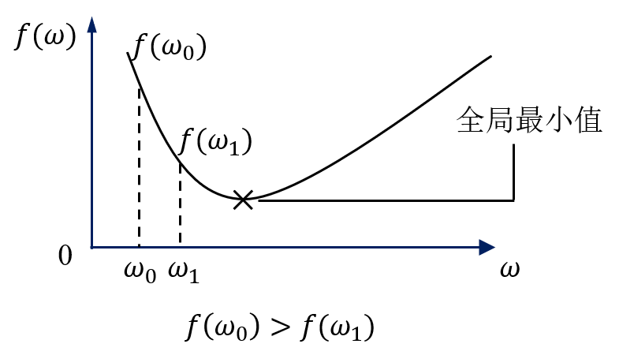

有很多方法可以寻找全局极小值，但是所有的方法本质都是一样的，就是根据f(w)的梯度不断试探。

一个优化问题是凸的 => 总能找到高效快速的算法去解决它

线性可分条件下的支持向量机求解是凸优化的问题，因此可以被快速的解决。

本课程不详细探讨如何求解凸优化问题，而只是假定把问题转化为凸优化问题后，用解凸优化问题的算法工具包很方便的解出。

求解凸优化问题是一个专门的课程 => 《凸优化理论》

#### 思考题

支持向量机的限制条件如果从大于等于1变成大于等于2，则(w, b)会变成(aw, ab)。

请问：

如果Xi和w是M维向量，那么你能算出a是多少吗？

