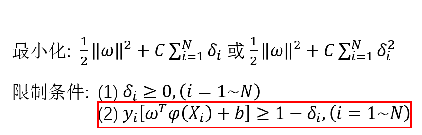

# 支持向量机

- [2.1 线性可分定义](#2.1)
- [2.2 问题描述](#2.2)
- [2.3 优化问题](#2.3)
- [2.4 线性不可分情况](#2.4)
- [2.5 低维到高维的映射](#2.5)
- [2.6 核函数的定义](#2.6)
- [2.7 原问题和对偶问题](#2.7)
- [2.8 转化为对偶问题](#2.8)
- [2.9 算法流程](#2.9)
- [2.10 兵王问题描述](#2.10)
- [2.11 兵王问题程序设计](#2.11)
- [2.12 兵王问题MATLAB程序](#2.12)
- [2.13 识别系统的性能度量](#2.13)
- [2.14 多类情况](#2.14)

## 2.1 线性可分定义

线性可分（Linear Separable）

线性不可分（Nonlinear Separable）

3维线性可分与线性不可分：

特征空间维度 ≥ 四维时 => 超平面（Hyperplane）

特征空间是2维时：

用数学严格定义训练样本以及它们的标签：

假设我们有N个训练样本和它们的标签

**用数学严格的定义线性可分**

线性可分的严格定义：一个训练样本集{(Xi, yi), ..., (XN, yN)}，在i=1-N线性可分，是指存在(w1, w2, b)，使得对i=1-N，有：

**用向量的形式来定义线性可分**

假设：

如果：

一个训练样本集{(Xi, yi)}，在i=1-N线性可分，是指存在(w, b)，使得对i=1-N，有：

#### 总结

请通过数学定义严格证明，在二分类情况下，如果一个数据集是线性可分的，即存在一个超平面将两个类别完全分开那么一定存在无数多个超平面将这两个类别完全分开。

## 2.2 问题描述

支持向量机算法

一、解决线性可分问题；

二、再将线性可分问题中获得的结论推广到线性不可分情况。

#### 如何解决线性可分问题

Vladimir Vapnik：在这无数多个分开各个类别的超平面中，到底哪一个最好呢？

二维特征空间中的二分类问题

认为2号线比较好，实际上是对训练样本的分布有一定的假设。

假设训练样本的位置在特征空间上有测量误差（认为2号线比较好的假设有很多种，这里只取其中的一种）

#### 基于最优化理论

VAPNIK给出的回答

使用MARGIN最大条件 => 不能唯一确定一条直线

这条线在上下两个平行线的中间

**支持向量机寻找的最优分类直线应满足：**

（1）该直线分开了两类；

（2）该直线最大化间隔（margin）；

（3）该直线处于间隔的中间，到所有支持向量距离相等。

上述讨论时是基于二维特征空间的结果，在高维的特征空间中，直线将变成超平面，但以上的结论仍然是一致的。

#### 思考题

证明：在线性可分条件下，有且只有唯一一条直线，满足上面三个条件。

## 2.3 优化问题

最优分类超平面应该满足：

1. 该超平面分开了两个类；

2. 该超平面有最大化间隔；

3. 该超平面处于间隔的中间，到所有支持向量距离相等。

如何用严格的数学 => 寻找最优分类超平面的过程 => 写成一个最优化问题

**假定训练样本集是线性可分的**

支持向量机需要寻找的是最大化间隔（MARGIN）的超平面

#### 最小化（Minimize）

因此，支持向量机的问题是最小化w模的平方。

#### 限制条件

已知：训练样本集{(Xi, yi)}，i=1-N；

待求：(w, b)

支持向量机要找一个超平面，使它的间隔最大；离两边所有支持向量的距离相等（恰好在间隔的中间）。

事实1：

事实2：

点到超平面的距离公式

**支持向量机优化问题推导中最难理解的部分**

用 a 去缩放 wb

(w, b)表示的超平面和(aw, ab)表示的超平面是同一个平面。

参数a去缩放(w, b)

根据事实2，支持向量X0到超平面的距离将会变为：

最大化支持向量到超平面的距离，等价于最小化w的模。

优化问题定为：

之所以这样定，是因为后续求导更方便。

限制条件：

支持向量到超平面的距离为w模的1/2，而其他非支持向量到超平面的距离一定是大于支持向量到超平面的距离的

在非支持向量上：

综上，支持向量机的限制条件：

其中yi的作用是协调超平面的左右，让超平面一边大于1，另一边小于1。

值得注意的是，上述条件中右边的1可以为任意的正数，

根据事实1，它们代表的是同一个平面、

#### 总结

线性可分情况下，支持向量机寻找最佳超平面的优化问题可以表示为：

凸优化（Convex Optimization）

这是凸优化问题中的二次规划问题

二次规划的定义：

（1）目标函数（Objective Function）是二次项。

（2）限制条件是一次项。

要么无解，要么只有唯一的最小值。

在最优化的理论当中，如果一个问题是凸优化问题，我们就会把它当成是一个已经解决的问题，因为凸优化问题只有唯一的一个全局的极值。我们可以应用梯度下降的算法求得它的解。

凸优化问题 => 唯一一个全局极值

**凸优化问题的例子**

有很多方法可以寻找全局极小值，但是所有的方法本质都是一样的，就是根据f(w)的梯度不断试探。

一个优化问题是凸的 => 总能找到高效快速的算法去解决它

线性可分条件下的支持向量机求解是凸优化的问题，因此可以被快速的解决。

本课程不详细探讨如何求解凸优化问题，而只是假定把问题转化为凸优化问题后，用解凸优化问题的算法工具包很方便的解出。

求解凸优化问题是一个专门的课程 => 《凸优化理论》

#### 思考题

支持向量机的限制条件如果从大于等于1变成大于等于2，则(w, b)会变成(aw, ab)。

请问：

如果Xi和w是M维向量，那么你能算出a是多少吗？

## 2.4 线性不可分情况

线性可分情况下，支持向量机寻找最佳超平面的优化问题可以表示为：

如果训练样本集是线性不可分的，那么以上问题的解是什么呢？

在线性不可分的情况下，以上的优化问题是无解的，即不存在w和b，满足上面所有N个限制条件。

对于线性不可分的情况，需要适当放松限制条件，使上面的最优化问题变得有解。

（于是可以把上面N个不等式的限制条件放松为以下的限制条件）

对于线性不可分情况，需适当放松限制条件。

还得加入新的限制阻止每个δi无限的扩大，让它限制在一个合理的范围内。

改造后的支持向量机优化版本

（凸优化问题）

以前的目标函数只需要最小化 w模的平方的1/2 即可。而现在的目标函数增加了一项，所有δi 的总和。

这就意味着不仅要让w的模越小越好，同时也要让所有 δi 的和越小越好。

比例因子C => 平衡两项

平衡两项的比例因子C是人为设定的，人为事先设定的参数叫做算法的超参数（Hyper Parameter）

不断变化C的值 => 同时测试算法的识别率 => 选取超参数C

可以看出，如果一个算法的超参数越多，意味着算法需要手动调整优化的地方也就越多，这样算法的自动性也会降低。

支持向量机是超参数很少的算法模型

在线性不可分情况下应用支持向量机

C取一个非常大的数，这样将会尽量的迫使所有δi趋近于0，使得最终解出的超平面和线性可分的情况下保持基本一致。

下图是训练数据以及解出的分类面的展示。

问题出在哪里呢？

我们假设分开两类的函数是线性的，也就是假设分开两类的函数是直线或者超平面，我们是在一组直线和超平面中选择最适合这两类数据的直线或超平面，但是线性模型的表现力是不够的。

如果坚持分开两类的必须是直线，那么无论怎么取这条直线，结果都是不好的。

因此只有想办法扩大可选函数的范围，使它超越线性，才有可能应对各种复杂的线性不可分的情况。

支持向量机如何扩大可选函数范围，从而提高非线性可分处理的能力

#### 思考题

把本来线性不可分的训练样本集x1, x2变为线性可分

请问：在这个例子中，你能否设计出一个这样的非线性变换，将这个分类问题转化为线性可分呢？

## 2.5 低维到高维的映射

支持向量机如何扩大可选函数的范围，从而提高处理非线性可分数据集的能力。

支持向量机在扩大可选函数范围方面可谓独树一帜。

人工神经网络：通过多层非线性函数的组合，能够产生类似于椭圆这样的曲线，从而分开以下图中显示的样本。

支持向量机不是直接产生这样的函数，而是将特征空间由低维映射到高维，然后在高维特征空间当中，用线性超平面对数据进行分类。

#### 考察如图的异或问题

线性不可分

构造一个二维到五维的映射，在五维的特征空间当中，这个例子将有可能变成线性可分的

当映射变成五维时

设

人为指定一个二维到五维的映射，线性不可分 => 线性可分

**以下定理说明了更一般的结论：**

假设：

在一个M维空间上随机去N个训练样本，同时随机的对每个训练样本赋予标签+1或-1

假设：

这些训练样本线性可分的概率维P(M)，则有当M趋于无穷大时 P(M)=1

当我们增加特征空间的维度M时，超平面待估计参数(w, b)的维度也会增加。

也就是说整个算法模型的自由度会增加，当然就更有可能分开低维时候无法分开的数据集。

整个定理告诉我们，将训练样本由低维映射到高维，能增大线性可分的概率。因此，我们如何构造一个由低维到高维的映射，就成为一个关键性的问题。

**假设映射关系已经确定下来**

支持向量即优化问题

以上公式只需要改变一点，变成下列即可：

可以看到在以上优化问题当中

这里还有一个隐含的前提条件，在前一个优化问题当中（这是低维的情况）

而在后一个优化问题当中（这是高维的情况）

高维情况下优化问题的解法和低维情况是完全类似的，都可以用凸优化理论完成支持向量机的求解。

**问题**

低维到高维的映射，具体取什么样的形式呢？

## 2.6 核函数的定义

这一讲中具体研究映射函数的形式，以此为基础，引入核函数（Kernel Function）的概念。

Vapnik：可以不用知道映射函数的具体形式，取而代之，如果对任意两个向量X1和X2，我们知道

那么，我们仍然能够通过一些技巧，获得一个测试样本X的类别信息，从而完成对测试样本类别的预测。

在这里，我们定义K(X1, X2)为核函数（Kernel Function），它是一个实数，因为

举两个例子来说明核函数以及低维到高维的映射之间的相互关系。

**假设**：

是一个将二维向量映射为三维向量的映射

我们看一下，与这个映射对应的核函数K的形式。

假设有两个二维向量

这是一个已知映射函数，求核函数的例子。

已知核函数K，求映射函数的例子

**假设**：

X是一个二维向量

假设

假设

K(X1, X2)就是前面那个形式，这个五维向量是可以可以交换顺序的。

这里我们可以看到，核函数K和映射是一一对应的关系，知道其中一个，可以求另外一个。

核函数的形式不能随意的取 => 需要满足一定的条件 => 才能分解为两个映射内积的形式

#### 支持向量机优化问题

Mercer 定理描述如下：

例如：可以证明

满足Mercer's Theorem

但在这个例子当中，映射函数却不能写成显示的表达式。

虽然无法知道映射函数的具体形式，但是却可以通过一些方法知道

的值，进而可以知道一个测试样本x所属的类别。

在这一节中，我们定义了核函数K(X1, X2)，同时指出了它和低维到高维的映射的相互决定关系。

下一节中将具体研究如何在已知K(X1, X2)，而不知道映射函数的情况下 => 求解支持向量机的优化问题

## 2.7 原问题和对偶问题

从更广泛的角度出发，阐述最优化理论中的原问题和对偶问题的定义，为后续进一步推导支持向量机的对偶问题做准备。

一个优化问题的原问题（Prime Problem）与它相对应的对偶问题（Dual Problem）定义如下：

#### 原问题与对偶问题的定义

这是一个相当宽泛的定义，我们规定的最优化问题的自变量w，它是一个多为向量，其中目标函数是f(w)。我们假设限制条件中不等式有K个，分别用gi(w)≤0来表示，其中i=1-K。同时我们假设限制条件中等式有m个，分别用hi(w)=0来表示。

#### 定义该原问题的对偶问题如下

定义函数：

在定义了函数L(w, α, β)的基础上，对偶问题如下：

综合原问题和对偶问题的定义得到：

定理一：

证明如下：

这个问题的解告诉我们，原问题的解总是大于等于对偶问题的解

我们把

定义为对偶差距（Duality Gap）

根据定理一，对偶差距 ≥ 0

#### 强对偶定理（Strong Duality Theorem）

如果g(w) = Aw+b，h(w) = Cx+d，f(w)为凸函数，则有

则对偶差距为0。

简单一点说就是，

如果：原问题的目标函数是凸函数，而限制条件是线性函数，那么原问题的解

对偶差距等于0。

证明过程参看《Convex Optimization》

假如

成立，有根据定理一推出的不等式，我们可以的得到

#### 总结

- 定义了原问题和对偶问题
- 强对偶定理
- KKT条件

## 2.8 转化为对偶问题

支持向量机的原问题满足强对偶定理

回顾目前支持向量机的优化问题：

为了利用上一讲中，原问题和对偶问题的分析，我们需要对一下问题的版本进行一定的改造

首先注意到，在原问题的描述中，gi(w)是小于等于0的。而在前面支持向量机的限制条件中，两个不等式都是大于等于0的，因此我们首先需要将前面的两个不等式都改成小于等于0的形式。

首先将

由于做了这样的变化，目标函数和第二个限制条件中，所有的δi也要取以前的相反数。

这样就得到，目标函数变为了

